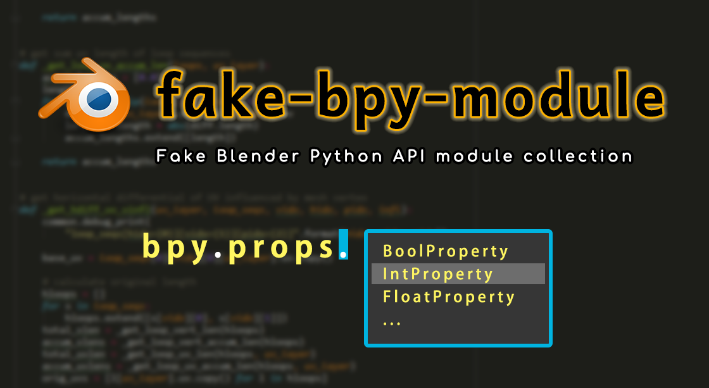

# Fake Blender Python API module collection: fake-bpy-module

fake-bpy-module is the collections of the fake Blender Python API modules for
the code completion in commonly used IDEs.

Note: The similar project for Blender Game Engine (BGE) is available on
[fake-bge-module](https://github.com/nutti/fake-bge-module) which targets
[UPBGE](https://upbge.org/).



*To realize the long support of this project, your support is helpful.*
*You can support the development of this project via*
**[GitHub Sponsors](https://github.com/sponsors/nutti)**.
*See [the contribution document](CONTRIBUTING.md) for the detail of*
*the support.*

## Requirements

fake-bpy-module requires Python 3.12.

## Install

fake-bpy-module can be installed via a pip package, or pre-generated modules.
You can also generate and install modules manually.

### Install via pip package

fake-bpy-module is registered to PyPI.  
You can install it as a pip package.

#### Install a latest package

If you install fake-bpy-module for Blender latest build (main branch daily
build powered by [nutti/blender-daily-build](https://github.com/nutti/blender-daily-build)),
run below command.

```sh
pip install fake-bpy-module
```

or, specify version "latest".

```sh
pip install fake-bpy-module-latest
```

#### Install a version specific package

If you want to install a version specific package, run below command.

```sh
pip install fake-bpy-module-<version>
```

If you install fake-bpy-module for Blender 2.93, run below command.

```sh
pip install fake-bpy-module-2.93
```

*Note: For PyCharm users, change the value `idea.max.intellisense.filesize` in
`idea.properties` file to more than 2600 because some modules have the issue of
being too big for intelliSense to work.*

##### Supported Blender Version

|Version|PyPI|
|---|---|
|2.78|[https://pypi.org/project/fake-bpy-module-2.78/](https://pypi.org/project/fake-bpy-module-2.78/)|
|2.79|[https://pypi.org/project/fake-bpy-module-2.79/](https://pypi.org/project/fake-bpy-module-2.79/)|
|2.80|[https://pypi.org/project/fake-bpy-module-2.80/](https://pypi.org/project/fake-bpy-module-2.80/)|
|2.81|[https://pypi.org/project/fake-bpy-module-2.81/](https://pypi.org/project/fake-bpy-module-2.81/)|
|2.82|[https://pypi.org/project/fake-bpy-module-2.82/](https://pypi.org/project/fake-bpy-module-2.82/)|
|2.83|[https://pypi.org/project/fake-bpy-module-2.83/](https://pypi.org/project/fake-bpy-module-2.83/)|
|2.90|[https://pypi.org/project/fake-bpy-module-2.90/](https://pypi.org/project/fake-bpy-module-2.90/)|
|2.91|[https://pypi.org/project/fake-bpy-module-2.91/](https://pypi.org/project/fake-bpy-module-2.91/)|
|2.92|[https://pypi.org/project/fake-bpy-module-2.92/](https://pypi.org/project/fake-bpy-module-2.92/)|
|2.93|[https://pypi.org/project/fake-bpy-module-2.93/](https://pypi.org/project/fake-bpy-module-2.93/)|
|3.0|[https://pypi.org/project/fake-bpy-module-3.0/](https://pypi.org/project/fake-bpy-module-3.0/)|
|3.1|[https://pypi.org/project/fake-bpy-module-3.1/](https://pypi.org/project/fake-bpy-module-3.1/)|
|3.2|[https://pypi.org/project/fake-bpy-module-3.2/](https://pypi.org/project/fake-bpy-module-3.2/)|
|3.3|[https://pypi.org/project/fake-bpy-module-3.3/](https://pypi.org/project/fake-bpy-module-3.3/)|
|3.4|[https://pypi.org/project/fake-bpy-module-3.4/](https://pypi.org/project/fake-bpy-module-3.4/)|
|3.5|[https://pypi.org/project/fake-bpy-module-3.5/](https://pypi.org/project/fake-bpy-module-3.5/)|
|3.6|[https://pypi.org/project/fake-bpy-module-3.6/](https://pypi.org/project/fake-bpy-module-3.6/)|
|4.0|[https://pypi.org/project/fake-bpy-module-4.0/](https://pypi.org/project/fake-bpy-module-4.0/)|
|4.1|[https://pypi.org/project/fake-bpy-module-4.1/](https://pypi.org/project/fake-bpy-module-4.1/)|
|4.2|[https://pypi.org/project/fake-bpy-module-4.2/](https://pypi.org/project/fake-bpy-module-4.2/)|
|latest|[https://pypi.org/project/fake-bpy-module/](https://pypi.org/project/fake-bpy-module/)|
||[https://pypi.org/project/fake-bpy-module-latest/](https://pypi.org/project/fake-bpy-module-latest/)|

### Install via pre-generated modules

Download Pre-generated modules from [Release page](https://github.com/nutti/fake-bpy-module/releases).

The process of installation via pre-generated modules is different by IDE.
See the installation processes as follows for detail.

* [PyCharm](docs/setup_pycharm.md)
* [Visual Studio Code](docs/setup_visual_studio_code.md)
* [All Text Editor (Install as Python module)](docs/setup_all_text_editor.md)

### Generate Modules Manually

You can also generate modules manually.
See [Generate Module](docs/generate_modules.md) for detail.

## Change Log

See [CHANGELOG.md](CHANGELOG.md)

## Bug report / Feature request / Disscussions

If you want to report bug, request features or discuss about this project, see
[ISSUES.md](ISSUES.md).

[fake-bpy-module channel](https://discord.gg/dGU9et5S2d) is
available on the Discord server.  
The timely discussion and release announcement about fake-bpy-module will be
made in this channel.

## Contribution

If you want to contribute to this project, see [CONTRIBUTING.md](CONTRIBUTING.md).

## Project Authors

### Owner

[**@nutti**](https://github.com/nutti)

Indie Game/Application Developer.  
Especially, I spend most time to improve Blender and Unreal Game Engine via
providing the extensions.

Support via [GitHub Sponsors](https://github.com/sponsors/nutti)

* CONTACTS: [Twitter](https://twitter.com/nutti__)
* WEBSITE: [Japanese Only](https://colorful-pico.net/)

### Contributors

* [**@grische**](https://github.com/grische)
* [**@echantry**](https://github.com/echantry)
* [**@kant**](https://github.com/kant)
* [**@theoryshaw**](https://github.com/theoryshaw)
* [**@espiondev**](https://github.com/espiondev)
* [**@JonathanPlasse**](https://github.com/JonathanPlasse)
* [**@UuuNyaa**](https://github.com/UuuNyaa)
* [**@Road-hog123**](https://github.com/Road-hog123)
* [**@Andrej730**](https://github.com/Andrej730)
