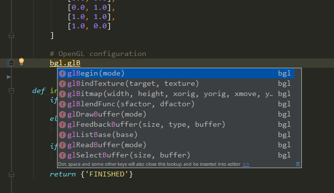

# Setup IDE: PyCharm




#### 1. Download the premade module

Download the premade module from GitHub.

Use Git and clone fake-bpy-module repository.

```
$ git clone https://github.com/nutti/fake-bpy-module.git
```

or

Download .zip file from GitHub.

https://github.com/nutti/fake-bpy-module/archive/master.zip


#### 2. Check premade module location

Check the location of premade module and remember it because we use it process 3.  
The premade module is located in `premade_modules`.
You can see each version of the premade module on there.


#### 3. Include the module as the external library

Launch PyCharm and do all below procedures.

1. Show *Settings* (Windows) or *Preferences* (macOS) window.
  * (Windows) Click *File* > *Settings*
  * (macOS) Click *Pycharm Menu* > *Preferenes*
2. Select *Project: <Your Project>* > *Project Interpreter*.
3. Click *Gear* icon on the right next to *Project Interpreter:*, and a popup menu is shown.
4. Click *More...* on the popped up menu.
5. In *Project Interpreters* window, click the bottom icon *Show paths for the selected Interpreter* to show *Interpreter Paths* window.
6. Click *+* icon, and a file browser is launched.
7. Select the path where premade module is located, and click *OK*.
8. Click *OK* repeatedly until *Settings* (Windows) or *Preferences* (macOS) window is closed.
9. Now, you can complete the code related to the Blender Python API.


# More information

* [Stack Overflow: PyCharm import external library](https://stackoverflow.com/questions/24197970/pycharm-import-external-library)
* [Blender – Interplanety: Using external IDE PyCharm for writing Blender scripts](https://b3d.interplanety.org/en/using-external-ide-pycharm-for-writing-blender-scripts/)
