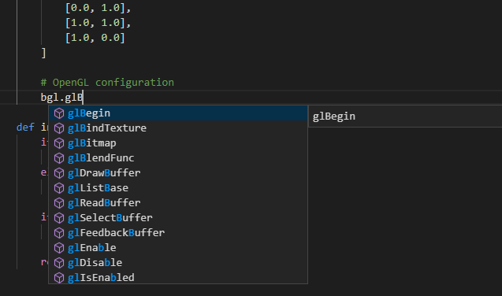

# Setup IDE: Visual Studio Code




#### 1. Check the generated modules location

Check the location of the generated modules.  


#### 2. Download the visual studio code extension

Download [the visual studio code extension for Python](https://marketplace.visualstudio.com/items?itemName=ms-python.python) and restart the visual studio code.


#### 3. Add Auto Complete path

Add the path for the auto completion from Visual Studio.

1. Click *File* > *Preferences* > *Settings*.
2. On `settings.json` page, add the generated modules path to `python.autoComplete.extraPaths`

* Example of settings.json

```json
{
    "python.autoComplete.extraPaths": [
        "<path-to-generated-modules>"
    ]
}
```
